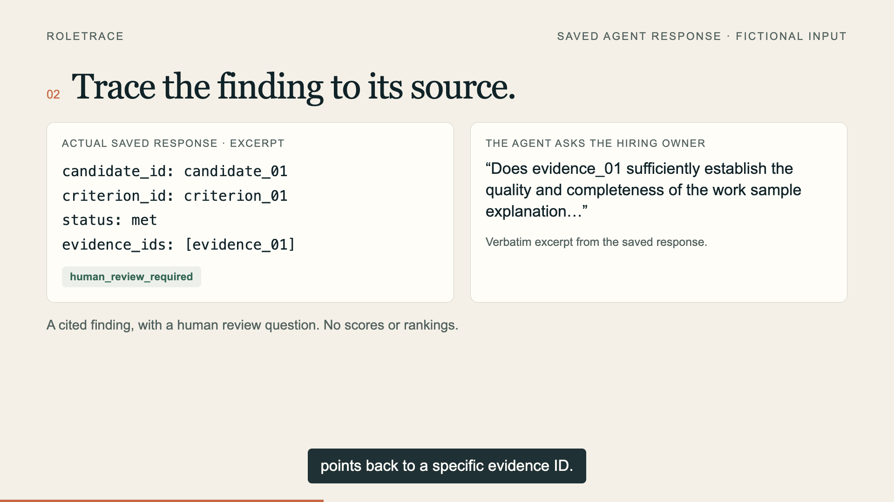

# Roletrace

Hiring evidence. Clear sources. Human decisions.


Turn job criteria and anonymized work-sample evidence into a cited review: what is supported, what is missing, and what the hiring owner needs to check. The human retains hiring decisions and candidate communication.

When a teammate corrects the evidence, see which finding changed and which stayed the same, with the original excerpts and previous review preserved.

## See a correction, end to end

In the [fictional walkthrough](examples/roletrace/README.md), an excerpt initially says the candidate authored accessibility tests. A clarification says they reviewed a teammate's test output. The authorship finding changes from `met` to `unknown`; the separate rollback finding stays unchanged. The readable report pairs each finding with its exact source excerpt and shows the correction comparison.

These are manually authored offline fixtures, not a live model demonstration or applicant review. [Verification and limits](docs/VERIFICATION.md) explain what the checks establish. The published video below separately shows the earlier saved agent response and labeled simulated collaboration.

This is the separate recruiter entry for the [AI Worth Using OpenClaw 2.0 hackathon](https://luma.com/zhkhsnpa). The public Agent Index listing is verified and the demo is attached. Genuine hiring use, real collaborator validation, and entrant eligibility remain separate outstanding gates. The repository includes an isolated native OpenClaw installer and scoped Agent Index tooling.

## Plow cloud hosting

The [cloud variant](docs/CLOUD.md) uses the official Plow OpenClaw base for messaging and automatic usage reporting per installation. It uses the approved Plow GLM 5.2 route with no fallback and needs no NVIDIA key. The Agent Index lists this agent as verified and one-click deployable. Real-user review and collaborator validation remain outstanding.

## Start a first review

Open [Text this agent on Agent Index](https://aiworthusing.com/agent-index/recruiter-associate) and ask: “Help me review one work-sample excerpt against one job criterion.” The agent asks for missing authorization and source information, assigns neutral reference IDs, and prepares a cited draft after validation. Share only minimized evidence from an authorized source; hiring decisions stay with the owner.

Bring one criterion you actually need to assess and one short work-sample excerpt you are authorized to use. Expect a draft showing the supporting evidence, what remains unknown, and a question to resolve the gap. In an owner-authorized shared conversation, a collaborator can correct an excerpt and ask which finding changed. Roletrace should preserve the earlier version and explain the change. The [first-use pilot](docs/PILOT.md) measures whether this saves human effort.



This screenshot shows a saved response to fictional input. It does not establish real applicant use. A [real-user pilot protocol](docs/PILOT.md) is prepared; participants are not yet available.

## Run locally

Python 3.10+ is required. Start with the network free recruiter CLI:

```sh
python3 -m recruiter prepare --input experiments/recruiter/fixture.json --output-dir runtime/recruiter-demo
```

For a packaged install, see [Docker instructions](docs/CONTAINER.md). For the dedicated native OpenClaw agent, follow [INSTALL.md](docs/INSTALL.md). It uses its own state and port 20789, the explicit NVIDIA `z-ai/glm-5.3` route, and no fallback. It does not alter the parked Trail agent or your default OpenClaw gateway.

## What is included

- Frozen synthetic recruiter fixture, guarded prompt and deterministic evaluation code under `experiments/recruiter/`.
- Offline prompt preparation and review validation under `recruiter/`. [Real mode](docs/WORKFLOW.md) requires explicit operator attestations and minimized evidence; it provides cited findings without candidate scores or rankings. No real applicant run has been verified.
- Roletrace skill and founder review instructions.
- Native installer with a pinned Python launcher and streaming usage accounting enabled.
- Official Agent Index client and a wrapper limited to this agent's usage store. See [REPORTING.md](docs/REPORTING.md).

Historical experiments reported the refined guarded arm passing seven fixture gates in two consecutive runs. Those provider runs were not repeated during repository extraction. See [experiment history](docs/EXPERIMENT-HISTORY.md). Pattern filtering and synthetic scores do not establish comprehensive privacy protection, fairness, legal compliance or real adoption.

## Demo video

The [94-second Roletrace demo](https://www.youtube.com/watch?v=-CKQ7tGdFxE) is published unlisted, with captions and the Roletrace OpenAI-generated cover. It clearly labels fictional inputs and simulated collaboration. [Source, provenance, and publication status](docs/DEMO.md). YouTube signed-out playback and Agent Index attachment are verified. Narration uses ElevenLabs Brian - Relatable Everyman.

## Hackathon finish line

The [public Agent Index listing](https://aiworthusing.com/agent-index/recruiter-associate) is registered. A [simulated multiplayer check](docs/MULTIPLAYER.md) verified separate profile attribution and a shared review correction. Still required: genuine user tasks and reported usage, an install proven by another operator. Organizer verification and video publication are recorded in the current launch checklist. Synthetic applicants and test runs are excluded from reporting. See [the launch checklist](docs/HACKATHON.md).

The intended multiplayer flow is an authorized hiring owner and collaborator reviewing cited findings and recording their own decisions in a shared OpenClaw conversation. Applicant material is untrusted input. Candidate facing access requires separate isolation and consent; this repository does not expose an owner gateway publicly.

The technical identifier `recruiter-associate` remains in existing install paths, skill names, registry coordinates, and the Agent Index URL to preserve existing installs and links. Roletrace is the display name; new installs use Roletrace; existing hosted instances keep their prior version. The builder’s local installed display name and prompt headings were migrated with backups, without changing reporting identity.

## Data and license

MIT for this project. The vendored official Agent Index client retains its Apache 2.0 license. Only explicitly synthetic applicant fixtures belong in this public repository. Keep resumes, contacts, conversations, credentials and real hiring records outside tracked source. Do not send outreach or make automated hiring dispositions.
